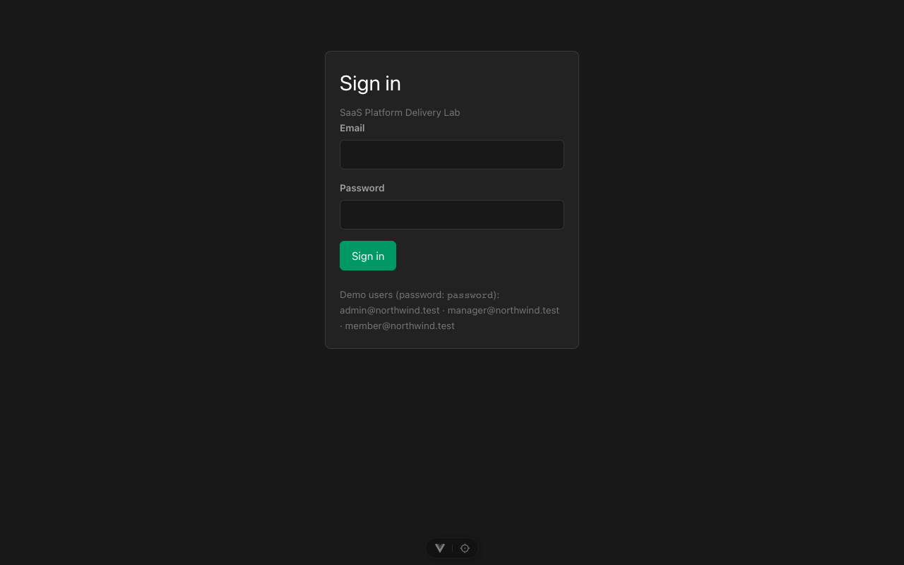
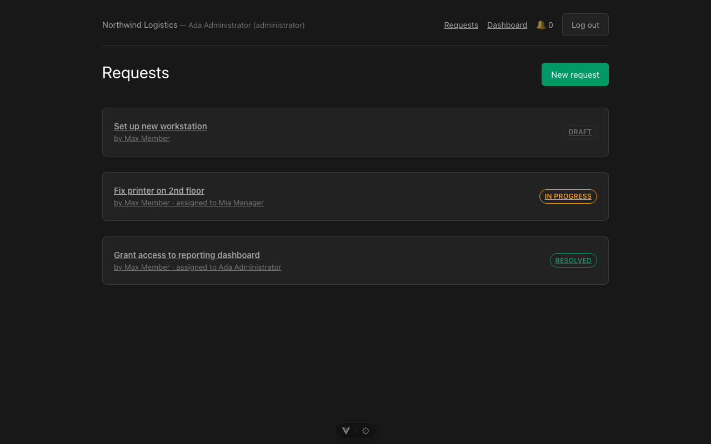
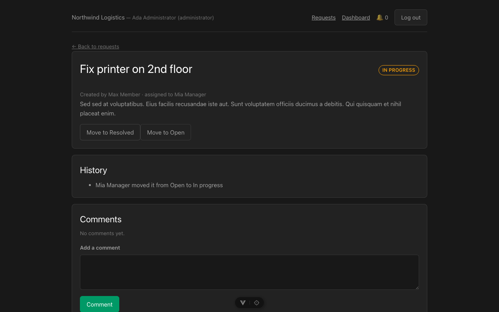
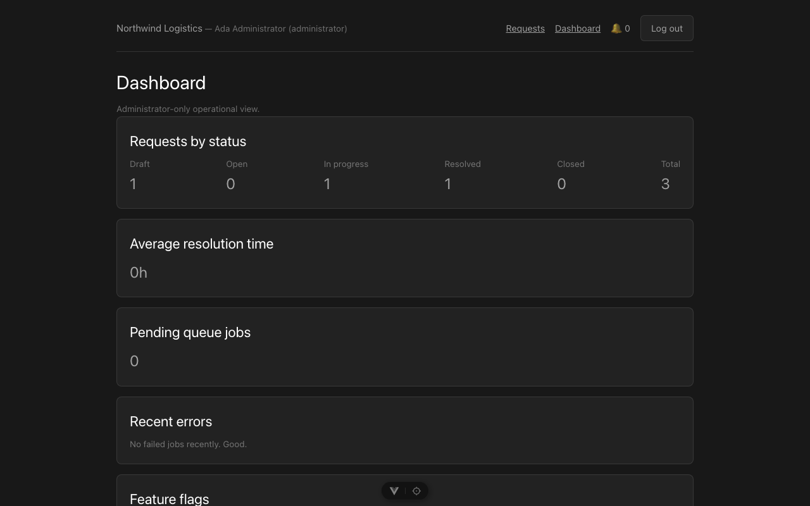

# SaaS Platform Delivery Lab

Proyecto de portfolio que demuestra criterio de arquitectura y gestión de entrega en una plataforma SaaS multi-tenant, sin sobredimensionar la solución.

## TL;DR

Plataforma SaaS multi-tenant pequeña pero real — Laravel 12 + Vue 3 + MySQL + RabbitMQ, en Docker — con **aislamiento entre organizaciones probado con tests adversariales** (no solo asumido), auth + autorización por rol, un flujo asíncrono real de extremo a extremo, feature flags por tenant, health checks, logs estructurados y manejo de errores consistente. 44 tests de backend + 6 de frontend, todos en verde.

```bash
cp .env.example .env && cp backend/.env.example backend/.env
cd backend && php artisan key:generate && cd ..
docker compose up -d
docker compose exec backend php artisan migrate --seed
```

Abre `http://localhost:5174` y entra con `admin@northwind.test` / `password` (más detalle en [Cómo ejecutar el proyecto](#cómo-ejecutar-el-proyecto)).

## Capturas

| Login | Solicitudes |
|---|---|
|  |  |

| Detalle de solicitud | Dashboard (Administrator) |
|---|---|
|  |  |

## Resumen ejecutivo

Una autoescuela u organización similar necesita coordinar solicitudes operativas internas (incidencias, peticiones de mantenimiento, tareas entre equipos) por organización, con trazabilidad de quién hizo qué y cuándo, y sin que una organización pueda ver los datos de otra. Este laboratorio construye una versión pequeña pero real de esa plataforma para demostrar decisiones de arquitectura, seguridad y entrega — no para venderse como producto.

## El problema

Cualquier SaaS B2B con múltiples organizaciones (tenants) enfrenta los mismos retos, independientemente de su dominio: aislar datos entre clientes, autorizar por rol dentro de cada organización, procesar trabajo en segundo plano sin bloquear la petición del usuario, y desplegar cambios con confianza sin degradar el servicio para todos los tenants a la vez. Este proyecto aborda esos retos con un caso de uso concreto: gestión de solicitudes operativas con estados, comentarios, historial y notificaciones asíncronas.

## Rol simulado

Se actúa como **Software Architect / Platform Engineer / Technical Project Manager** de un equipo pequeño: se toman y documentan decisiones de arquitectura (ADR), se define un plan de entrega por sesiones/hitos, y se gestionan riesgos y criterios de aceptación como en un proyecto real, aunque el "cliente" y los stakeholders sean simulados (ver `docs/stakeholder-map.md`, Sesión 4).

## Arquitectura

Backend (Laravel 12 API) y frontend (Vue 3 + TypeScript SPA) desacoplados, con MySQL como base de datos compartida (aislamiento multi-tenant por fila) y RabbitMQ para notificaciones asíncronas. Detalle completo, diagrama y decisiones evaluadas en:

- [`docs/architecture.md`](docs/architecture.md)
- [`docs/adr/`](docs/adr/) — registro de decisiones de arquitectura

## Cómo ejecutar el proyecto

Requisitos: Docker y Docker Compose.

```bash
cp .env.example .env
cp backend/.env.example backend/.env
cd backend && php artisan key:generate && cd ..
docker compose up -d
docker compose exec backend php artisan migrate --seed
```

El seeder crea 2 organizaciones independientes ("Northwind Logistics", "Blue Harbor Retail"), cada una con un usuario Administrator, Manager y Member (contraseña `password` para todos — ver la lista completa en la pantalla de login). Tener dos organizaciones desde el arranque es intencional: permite comprobar a simple vista que una nunca ve los datos de la otra.

Puertos expuestos en el host (remapeados para no chocar con otros stacks Docker que puedan estar corriendo en la misma máquina — ajusta si tu entorno está libre en los puertos "por defecto"):

| Servicio | URL local |
|---|---|
| Backend API | http://localhost:8000 (health check en `/up`) |
| Frontend (Vite dev) | http://localhost:5174 |
| MySQL | localhost:3307 |
| RabbitMQ (AMQP) | localhost:5673 |
| RabbitMQ (panel de administración) | http://localhost:15673 |

## Cómo ejecutar los tests

Backend (Pest, contra SQLite en memoria — no requiere Docker):

```bash
cd backend
composer install
./vendor/bin/pest
./vendor/bin/pint --test   # estilo de código
```

Frontend (Vitest):

```bash
cd frontend
npm install
npm run test:unit
npm run lint
npm run build              # incluye type-check con vue-tsc
```

## Principales decisiones

- Backend y frontend desacoplados (API + SPA), autenticados con Laravel Sanctum en modo SPA-stateful — [ADR 0002](docs/adr/0002-decoupled-api-and-spa.md)
- Multi-tenancy por base de datos compartida con aislamiento por fila (`organization_id` + Global Scope), no por base de datos separada — [ADR 0003](docs/adr/0003-multi-tenancy-strategy.md) (incluye una enmienda importante: `User` queda excluido del scope automático para evitar una recursión infinita al autenticar — es un bug real que apareció y se corrigió en la Sesión 2)
- Versiones de stack elegidas según el entorno disponible, no por ser las más recientes — [ADR 0001](docs/adr/0001-stack-selection.md)
- Nginx + PHP-FPM en vez de `php artisan serve` — [ADR 0004](docs/adr/0004-nginx-php-fpm-over-artisan-serve.md)
- Feature flags con Laravel Pennant, escopados por organización (activación progresiva por tenant, no un interruptor global) — ver `docs/architecture.md`
- Health checks separados (liveness/readiness/application health) y logs estructurados en JSON con correlation ID — ver [`docs/observability.md`](docs/observability.md)

## Estado del proyecto

**Sesión 3 de 5 completada: seguridad y casos de error.**

Funciona realmente, verificado con tests automatizados (44 backend + 6 frontend, todos pasando):
- **Aislamiento multi-tenant probado, no solo asumido**: `tests/Feature/TenantIsolationTest.php` intenta activamente que un usuario de una organización lea/comente/cambie el estado de recursos de otra por ID directo, y comprueba que siempre da 404 (nunca 403, para no confirmar que el recurso existe). `tests/Unit/TenantScopingArchitectureTest.php` impide que un modelo nuevo con `organization_id` se cree sin heredar el aislamiento automático.
- Validación reforzada: ya no se puede asignar una solicitud a un usuario de otra organización (antes solo se comprobaba que el usuario existiera, no a qué organización pertenecía).
- **Feature flag real** con Laravel Pennant, escopado por organización: un Administrator puede activar "los Members pueden cerrar sus propias solicitudes" solo para su organización, sin afectar a las demás.
- **Tres health checks** distintos según quién los consume: `/api/health/live` (¿vive el proceso?), `/api/health/ready` (¿puede atender tráfico? — comprueba BD y cache de verdad), `/api/health/app` (vista humana, añade RabbitMQ y versión).
- **Logs estructurados en JSON** con correlation ID por petición (reutilizado si el cliente ya manda uno, propagado automáticamente incluso a los jobs en cola).
- **Errores consistentes**: toda la API responde en JSON aunque el cliente no lo pida explícitamente; login limitado a 5 intentos/minuto por IP.
- **Dashboard operativo** (`/api/dashboard`, solo Administrator): solicitudes por estado, tiempo medio de resolución, errores recientes (sin exponer nunca el payload de los jobs fallidos, solo la excepción), trabajos pendientes en cola. Con una pantalla mínima en la SPA.
- **Verificación en navegador real, con clics** (login, listado, dashboard, activar/desactivar un feature flag) — se añadió un proxy de desarrollo en Vite (`vite.config.ts`) que resuelve la limitación de la Sesión 2 (el navegador de la herramienta de desarrollo bloqueaba peticiones entre puertos de `localhost`), y de paso simplifica el CORS en local. Detalle en `docs/architecture.md`.
- Un hueco real de seguridad encontrado y corregido esta sesión: la validación de "asignar a" no comprobaba la organización del usuario asignado — ver `tests/Feature/RequestTest.php`.

Pendiente / todavía simulado:
- Gestión de usuarios desde la UI (crear/editar usuarios de tu organización) — no implementado; los usuarios existen vía seeder.
- El rate limiting de login es por IP, no por cuenta — un ataque distribuido no quedaría cubierto.
- Documentación de gestión de proyecto (charter, RACI, riesgos, SLO/SLA, runbooks) — Sesión 4.

## Limitaciones conocidas

- Node local es 22.12.0; el scaffold de Vue pide `^22.18.0`. Funciona con avisos no bloqueantes; se recomienda actualizar Node antes de un uso prolongado.
- Los puertos de host en `docker-compose.yml` están remapeados (3307, 5673, 15673, 5174) porque el entorno de desarrollo ya tenía otro stack Docker ocupando los puertos por defecto. Ajusta `docker-compose.yml` si tu máquina los tiene libres.
- El aislamiento multi-tenant de `User` es manual, no automático — ver la enmienda del ADR 0003 antes de tocar ese modelo.
- "Errores recientes" y "cola pendiente" en el dashboard son señales de infraestructura compartidas por toda la app (no hay concepto de tenant en `failed_jobs` ni en la profundidad de la cola) — simplificación consciente, no un descuido de aislamiento.

## Próximos pasos

Ver tabla de sesiones y entregables en la introducción de este proyecto (conversación de planificación) y, a partir de la Sesión 4, en `docs/milestones.md` y `docs/delivery-plan.md`.

## Documentación

- [`docs/architecture.md`](docs/architecture.md)
- [`docs/observability.md`](docs/observability.md) — health checks, logs estructurados, manejo de errores
- [`docs/adr/`](docs/adr/)
- El resto de documentos de gestión (`docs/project-charter.md`, `docs/scope.md`, `docs/risk-register.md`, `docs/slo.md`, etc.) se añaden en la Sesión 4.
