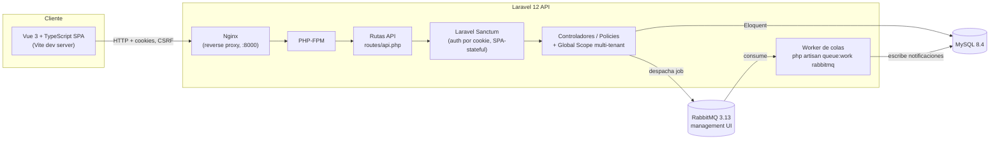

# Arquitectura — SaaS Platform Delivery Lab

> Este documento describe la arquitectura tal como existe al final de la Sesión 3 (seguridad y casos de error). Se irá ampliando en sesiones sucesivas. Las decisiones con alternativas evaluadas están en `docs/adr/`. Detalle de health checks y logging en [`docs/observability.md`](observability.md).

## Vista de componentes

## Componentes y responsabilidades

| Componente | Responsabilidad | Notas |
|---|---|---|
| `frontend/` (Vue 3 + TS) | UI de la SPA: login, listado/detalle de solicitudes, comentarios, cambio de estado | Consume la API vía Axios con cookies; no contiene lógica de autorización, solo la refleja |
| `webserver` (Nginx) | Sirve el backend, hace de proxy FastCGI hacia PHP-FPM | Sustituyó a `php artisan serve` en esta sesión — ver "Cambios respecto a la Sesión 1" |
| `backend/` (Laravel 12, PHP-FPM) | API REST, autenticación, reglas de negocio, aislamiento multi-tenant, autorización por rol | Ver ADR 0002 y ADR 0003 |
| `queue-worker` | Procesa jobs asíncronos (notificaciones) despachados a RabbitMQ | Mismo código que `backend/`, distinto comando de arranque; corre `migrate` también (idempotente) para no depender del orden de arranque |
| MySQL | Persistencia relacional, única base de datos compartida por todos los tenants | Ver ADR 0003 (modelo *pool*) |
| RabbitMQ | Cola de mensajes para notificaciones asíncronas | Reintentos vía `--tries`/`--backoff` de Laravel; los jobs fallidos terminan en `failed_jobs` (equivalente sencillo a una dead-letter queue), visibles en el dashboard operativo |

## Aislamiento multi-tenant

Cada tabla propiedad de una organización incluye `organization_id`. Un Global Scope de Eloquent aplica el filtro automáticamente; los modelos heredan de una clase base común para que el aislamiento no dependa de que cada desarrollador lo recuerde. Detalle completo en [ADR 0003](adr/0003-multi-tenancy-strategy.md).

Este aislamiento ya no es solo una afirmación de diseño: `tests/Feature/TenantIsolationTest.php` intenta activamente que un usuario de la organización A lea, comente o cambie el estado de un recurso de la organización B por ID directo (IDOR), y comprueba que la respuesta es siempre 404 (nunca 403 — un 403 confirmaría que el recurso existe en otro tenant, lo cual ya es una fuga de información). `tests/Unit/TenantScopingArchitectureTest.php` además impide, de forma automática, que un modelo nuevo con `organization_id` se cree sin heredar el aislamiento.

## Feature flags

Un feature flag de ejemplo (`App\Features\MembersCanCloseOwnRequests`, vía [Laravel Pennant](https://laravel.com/docs/pennant)) demuestra "activación progresiva": está escopado por `Organization`, así que un Administrator puede activarlo para su propia organización (`PATCH /api/feature-flags/{key}`) sin afectar a las demás — el patrón real de rollout gradual en un SaaS multi-tenant, no un simple interruptor global. Cuando está activo, un Member puede cerrar una solicitud que él mismo creó (normalmente reservado a Administrator/Manager/el asignado).

## Manejo de errores y observabilidad

- Toda la API responde siempre en JSON (incluso sin `Accept: application/json`) con forma consistente entre 401/403/404/422/500.
- `/api/login` limitado a 5 intentos/minuto por IP.
- Tres health checks distintos (liveness/readiness/application health) y logs estructurados en JSON con correlation ID por petición, propagado incluso a los jobs en cola. Detalle completo en [`docs/observability.md`](observability.md).
- Dashboard operativo (`GET /api/dashboard`, solo Administrator): solicitudes por estado, tiempo medio de resolución, errores recientes (de `failed_jobs`, sin exponer nunca el payload) y trabajos pendientes en la cola.

## Entornos

| Entorno | Cómo se levanta | Base de datos | Cola |
|---|---|---|---|
| Desarrollo local | `docker compose up` | MySQL en contenedor, datos persistidos en volumen `mysql_data` | RabbitMQ en contenedor |
| Tests automatizados (backend) | `./vendor/bin/pest` (fuera de Docker) | SQLite en memoria (`phpunit.xml`) | Driver `sync` (sin cola real) |
| Tests automatizados (frontend) | `npm run test:unit` (Vitest) | N/A | N/A |

Ver `docs/environment-strategy.md` (Sesión 4) para el detalle de promoción entre entornos.

## Fuera de alcance (explícito)

- Kubernetes o cualquier orquestador más allá de Docker Compose.
- Multi-tenancy por base de datos separada (modelo *silo*) — ver alternativas descartadas en ADR 0003.
- Despliegue a un proveedor cloud real o uso de servicios de pago.
- Autenticación de terceros vía API tokens (machine-to-machine); solo se cubre el flujo de sesión de la SPA.

## Cambios respecto a la Sesión 1

- **`php artisan serve` → Nginx + PHP-FPM.** El servidor de desarrollo integrado de PHP demostró ser poco fiable con peticiones reales de navegador (preflights CORS + peticiones concurrentes de la SPA le hacían perder conexiones). Se sustituyó por el par Nginx + PHP-FPM, más cercano a un entorno real y sin ese problema. Nginx resuelve el hostname de `backend` dinámicamente (DNS embebido de Docker) para no quedarse con una IP obsoleta si ese contenedor se reinicia solo.
- **Logging de errores de PHP-FPM habilitado explícitamente** (`docker/php-fpm-logging.conf`): por defecto PHP-FPM descarta la salida de los workers, lo que convertía cualquier error fatal en un 500 sin ninguna pista en los logs. Sin esto, un fallo real (ver más abajo) habría sido mucho más difícil de diagnosticar.

## Un bug real encontrado y corregido en esta sesión

Al verificar el flujo completo contra el stack de Docker (no solo con tests automatizados), una petición autenticada cualquiera devolvía **500 por agotamiento de memoria**. La causa: el modelo `User` tenía aplicado el mismo Global Scope multi-tenant que el resto de modelos, lo que provocaba una recursión infinita al autenticar (resolver "quién es el usuario" requiere consultar `users`, y esa consulta necesitaba saber "quién es el usuario" para filtrar por organización). Corregido excluyendo `User` del scope automático — detalle completo, y por qué los tests automatizados no lo detectaron, en la enmienda del [ADR 0003](adr/0003-multi-tenancy-strategy.md).

## Límites conocidos (arrastrados de sesiones anteriores)

- El aislamiento entre tenants para `User` es manual (no automático vía scope) — ver ADR 0003.
- Dead-letter explícito (cola/exchange dedicados para mensajes fallidos tras agotar reintentos) no está implementado; los jobs fallidos en `failed_jobs` cumplen el mismo propósito de forma más simple — decisión consciente, no pendiente.

## Resuelto en esta sesión: verificación visual en navegador

En la Sesión 2, verificar el flujo en pantalla se hacía por HTTP directo (`curl`) en vez de clics reales, porque el navegador embebido de la herramienta de desarrollo usada bloqueaba peticiones `fetch`/XHR de la SPA (`:5174`) hacia el backend (`:8000`) — dos puertos distintos de `localhost`.

Se resolvió con un **proxy de desarrollo en Vite** (`frontend/vite.config.ts`): `/api` y `/sanctum` se reenvían server-side al backend, así que desde el punto de vista del navegador todo vive en el mismo origen (`localhost:5174`) — ni CORS ni la restricción de peticiones entre puertos aplican. `src/lib/api.ts` usa una `baseURL` relativa por lo mismo. Es además el patrón habitual en desarrollo Vue+Laravel, no un parche solo para esta herramienta. Verificado con clics reales: login, listado de solicitudes, dashboard y activación de un feature flag, todo funcionando en el navegador.

## Límites conocidos de esta sesión (Sesión 3)

- El dashboard operativo (`/api/dashboard`) es solo de lectura y solo para Administrator; no hay aún una pantalla de gestión de usuarios (crear/editar usuarios de tu organización).
- "Errores recientes" y "trabajos pendientes en cola" en el dashboard son señales de infraestructura compartidas por toda la app (no hay concepto de tenant en `failed_jobs` ni en la profundidad de la cola) — es una simplificación consciente, documentada, no un descuido de aislamiento.
- El rate limiting de login es por IP, no por combinación IP+cuenta — suficiente para esta demo, pero un ataque distribuido (muchas IPs, una cuenta) no quedaría cubierto.
