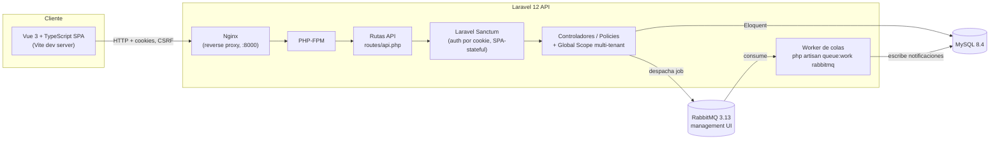

# Arquitectura — SaaS Platform Delivery Lab

> Este documento describe la arquitectura tal como existe al final de la Sesión 2 (primer flujo vertical funcional: organización → usuario con rol → solicitud → notificación asíncrona). Se irá ampliando en sesiones sucesivas. Las decisiones con alternativas evaluadas están en `docs/adr/`.

## Vista de componentes

## Componentes y responsabilidades

| Componente | Responsabilidad | Notas |
|---|---|---|
| `frontend/` (Vue 3 + TS) | UI de la SPA: login, listado/detalle de solicitudes, comentarios, cambio de estado | Consume la API vía Axios con cookies; no contiene lógica de autorización, solo la refleja |
| `webserver` (Nginx) | Sirve el backend, hace de proxy FastCGI hacia PHP-FPM | Sustituyó a `php artisan serve` en esta sesión — ver "Cambios respecto a la Sesión 1" |
| `backend/` (Laravel 12, PHP-FPM) | API REST, autenticación, reglas de negocio, aislamiento multi-tenant, autorización por rol | Ver ADR 0002 y ADR 0003 |
| `queue-worker` | Procesa jobs asíncronos (notificaciones) despachados a RabbitMQ | Mismo código que `backend/`, distinto comando de arranque; corre `migrate` también (idempotente) para no depender del orden de arranque |
| MySQL | Persistencia relacional, única base de datos compartida por todos los tenants | Ver ADR 0003 (modelo *pool*) |
| RabbitMQ | Cola de mensajes para notificaciones asíncronas | Reintentos vía `--tries`/`--backoff` de Laravel y `failed_jobs`; dead-letter explícito (exchange DLX) queda para Sesión 3 si se necesita más que el reintento estándar |

## Aislamiento multi-tenant

Cada tabla propiedad de una organización incluye `organization_id`. Un Global Scope de Eloquent aplica el filtro automáticamente; los modelos heredan de una clase base común para que el aislamiento no dependa de que cada desarrollador lo recuerde. Detalle completo en [ADR 0003](adr/0003-multi-tenancy-strategy.md).

## Entornos

| Entorno | Cómo se levanta | Base de datos | Cola |
|---|---|---|---|
| Desarrollo local | `docker compose up` | MySQL en contenedor, datos persistidos en volumen `mysql_data` | RabbitMQ en contenedor |
| Tests automatizados (backend) | `./vendor/bin/pest` (fuera de Docker) | SQLite en memoria (`phpunit.xml`) | Driver `sync` (sin cola real) |
| Tests automatizados (frontend) | `npm run test:unit` (Vitest) | N/A | N/A |

Ver `docs/environment-strategy.md` (Sesión 4) para el detalle de promoción entre entornos.

## Fuera de alcance (explícito)

- Kubernetes o cualquier orquestador más allá de Docker Compose.
- Multi-tenancy por base de datos separada (modelo *silo*) — ver alternativas descartadas en ADR 0003.
- Despliegue a un proveedor cloud real o uso de servicios de pago.
- Autenticación de terceros vía API tokens (machine-to-machine); solo se cubre el flujo de sesión de la SPA.

## Cambios respecto a la Sesión 1

- **`php artisan serve` → Nginx + PHP-FPM.** El servidor de desarrollo integrado de PHP demostró ser poco fiable con peticiones reales de navegador (preflights CORS + peticiones concurrentes de la SPA le hacían perder conexiones). Se sustituyó por el par Nginx + PHP-FPM, más cercano a un entorno real y sin ese problema. Nginx resuelve el hostname de `backend` dinámicamente (DNS embebido de Docker) para no quedarse con una IP obsoleta si ese contenedor se reinicia solo.
- **Logging de errores de PHP-FPM habilitado explícitamente** (`docker/php-fpm-logging.conf`): por defecto PHP-FPM descarta la salida de los workers, lo que convertía cualquier error fatal en un 500 sin ninguna pista en los logs. Sin esto, un fallo real (ver más abajo) habría sido mucho más difícil de diagnosticar.

## Un bug real encontrado y corregido en esta sesión

Al verificar el flujo completo contra el stack de Docker (no solo con tests automatizados), una petición autenticada cualquiera devolvía **500 por agotamiento de memoria**. La causa: el modelo `User` tenía aplicado el mismo Global Scope multi-tenant que el resto de modelos, lo que provocaba una recursión infinita al autenticar (resolver "quién es el usuario" requiere consultar `users`, y esa consulta necesitaba saber "quién es el usuario" para filtrar por organización). Corregido excluyendo `User` del scope automático — detalle completo, y por qué los tests automatizados no lo detectaron, en la enmienda del [ADR 0003](adr/0003-multi-tenancy-strategy.md).

## Límites conocidos de esta sesión

- El aislamiento entre tenants para `User` es manual (no automático vía scope) — ver ADR 0003.
- Dead-letter explícito (cola/exchange dedicados para mensajes fallidos tras agotar reintentos) no está implementado; por ahora los jobs fallidos terminan en la tabla `failed_jobs` de Laravel, que cumple el mismo propósito de forma más simple.
- La verificación visual en navegador de esta sesión se hizo por HTTP directo (`curl`, replicando exactamente cookies/CSRF/cabeceras de la SPA) en vez de clics en un navegador real, porque el navegador embebido de esta herramienta de desarrollo bloquea peticiones `fetch`/XHR de una pestaña hacia otro puerto de `localhost` (confirmado con una prueba mínima: ni siquiera un `fetch` sin credenciales a un endpoint público lo consigue, mientras que la navegación completa a esa URL sí funciona). No es una limitación de la aplicación — se recomienda abrir `http://localhost:5174` en un navegador normal para verlo funcionar de extremo a extremo.
