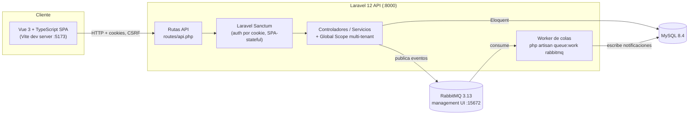

# Arquitectura — SaaS Platform Delivery Lab

> Este documento describe la arquitectura tal como existe al final de la Sesión 1 (estructura y esqueleto ejecutable). Se irá ampliando en sesiones sucesivas conforme se implementen funcionalidades. Las decisiones con alternativas evaluadas están en `docs/adr/`.

## Vista de componentes

## Componentes y responsabilidades

| Componente | Responsabilidad | Notas |
|---|---|---|
| `frontend/` (Vue 3 + TS) | UI de la SPA: login, gestión de solicitudes, dashboard | Consume la API vía `fetch`/Axios con cookies; no contiene lógica de autorización, solo la refleja |
| `backend/` (Laravel 12) | API REST, autenticación, reglas de negocio, aislamiento multi-tenant, autorización por rol | Ver ADR 0002 y ADR 0003 |
| `queue-worker` | Procesa jobs asíncronos (notificaciones) despachados a RabbitMQ | Mismo código que `backend/`, distinto comando de arranque |
| MySQL | Persistencia relacional, única base de datos compartida por todos los tenants | Ver ADR 0003 (modelo *pool*) |
| RabbitMQ | Cola de mensajes para notificaciones asíncronas, con reintentos y dead-letter (Sesión 2) | UI de administración expuesta solo en local, nunca en producción sin autenticación reforzada |

## Aislamiento multi-tenant

Cada tabla propiedad de una organización incluye `organization_id`. Un Global Scope de Eloquent aplica el filtro automáticamente; los modelos heredan de una clase base común para que el aislamiento no dependa de que cada desarrollador lo recuerde. Detalle completo en [ADR 0003](adr/0003-multi-tenancy-strategy.md).

## Entornos

| Entorno | Cómo se levanta | Base de datos | Cola |
|---|---|---|---|
| Desarrollo local | `docker compose up` | MySQL en contenedor, datos persistidos en volumen `mysql_data` | RabbitMQ en contenedor |
| Tests automatizados (backend) | `./vendor/bin/pest` (fuera de Docker) | SQLite en memoria (`phpunit.xml`) | Driver `sync` (sin cola real) |
| Tests automatizados (frontend) | `npm run test:unit` (Vitest) | N/A | N/A |

Ver `docs/environment-strategy.md` (Sesión 4) para el detalle de promoción entre entornos.

## Fuera de alcance (explícito)

- Kubernetes o cualquier orquestador más allá de Docker Compose.
- Multi-tenancy por base de datos separada (modelo *silo*) — ver alternativas descartadas en ADR 0003.
- Despliegue a un proveedor cloud real o uso de servicios de pago.
- Autenticación de terceros vía API tokens (machine-to-machine); solo se cubre el flujo de sesión de la SPA.

## Límites conocidos de esta sesión

- El `Dockerfile` del backend usa `php artisan serve`, adecuado para desarrollo pero no para producción (no maneja concurrencia como PHP-FPM + Nginx). Se documenta como decisión consciente para mantener el Compose simple; se anota como mejora futura en `docs/deployment-runbook.md` (Sesión 4).
- Aún no existen modelos de dominio (`Organization`, `Request`, etc.) — se implementan en la Sesión 2 (primer flujo vertical).
