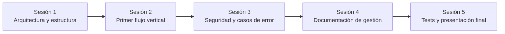

# Dependencias

## Técnicas (externas)

| Dependencia | Usada para | Riesgo si falla/cambia |
|---|---|---|
| Laravel 12 / PHP 8.4 | Backend API | Bajo — versión estable, LTS-adjacent; ver [ADR 0001](adr/0001-stack-selection.md) |
| Vue 3 / Vite / TypeScript | Frontend SPA | Bajo |
| MySQL 8.4 | Persistencia | Medio — toda la app depende de que esté sana; cubierto por el health check de readiness |
| RabbitMQ 3.13 | Notificaciones asíncronas | Medio — si no está disponible, las peticiones síncronas siguen funcionando (el fallo es solo en notificaciones); cubierto por `/api/health/app` |
| Laravel Sanctum | Autenticación SPA | Alto — toda la autorización depende de esto; es un paquete first-party de Laravel, riesgo de mantenimiento bajo |
| Laravel Pennant | Feature flags | Bajo — solo afecta a una funcionalidad de ejemplo |
| Docker / Docker Compose | Entorno de desarrollo reproducible | Medio — sin Docker, levantar el proyecto requiere instalar PHP/MySQL/RabbitMQ manualmente (no documentado, no soportado) |
| GitHub | Control de versiones, histórico | Alto — es la única copia remota del código |

## De equipo (simuladas)

| Dependencia | Quién depende de quién | Notas |
|---|---|---|
| Cierre de la Sesión 3 antes de documentar `slo.md` | Engineering Lead depende de que Security Advisor apruebe el aislamiento multi-tenant | Sin esa aprobación, cualquier SLO de disponibilidad sería prematuro — no tiene sentido prometer fiabilidad sobre una base insegura |
| `deployment-runbook.md` depende de la decisión de no desplegar | Engineering Lead depende de que Product Owner confirme la decisión de mantener el proyecto sin desplegar (ver `project-charter.md`) | Documentado como decisión explícita, no como pendiente |
| Dashboard operativo depende de Support Lead | Engineering Lead necesita saber qué querría ver Support antes de diseñar las métricas | En la práctica, se diseñó con las 4 métricas que pide el enunciado original del proyecto; ver `scope.md` |

## Entre sesiones (orden de entrega)

Esta cadena es estrictamente secuencial y deliberada: no se puede escribir un ADR sobre aislamiento multi-tenant (Sesión 1) antes de tener modelos de dominio que aislar (Sesión 2); no tiene sentido escribir tests adversariales (Sesión 3) sobre un flujo que no existe todavía; y la documentación de gestión (Sesión 4) referencia decisiones y bugs reales de las sesiones anteriores — escribirla antes las habría dejado como ficción en vez de como registro.
