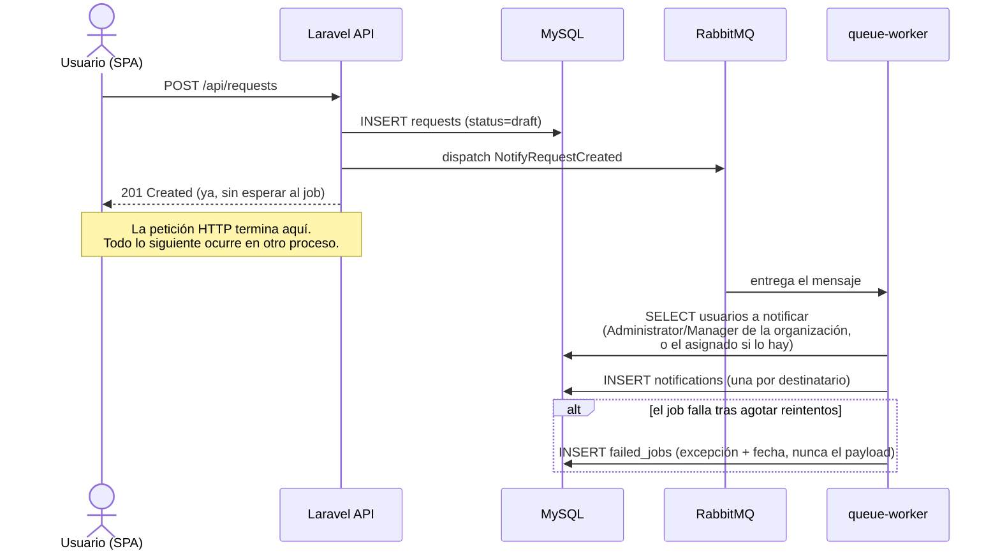

# Diagrama: secuencia de notificación asíncrona

De extremo a extremo, desde que un usuario crea una solicitud hasta que la notificación existe en base de datos — la pieza que demuestra que el trabajo en segundo plano es real, no una simulación síncrona disfrazada.

El `correlation_id` de la petición HTTP original se propaga automáticamente al contexto del job (vía `Illuminate\Support\Facades\Context` — ver `docs/observability.md`), aunque hoy no se registra explícitamente ningún log dentro de `NotifyRequestCreated::handle()` que lo aproveche.
