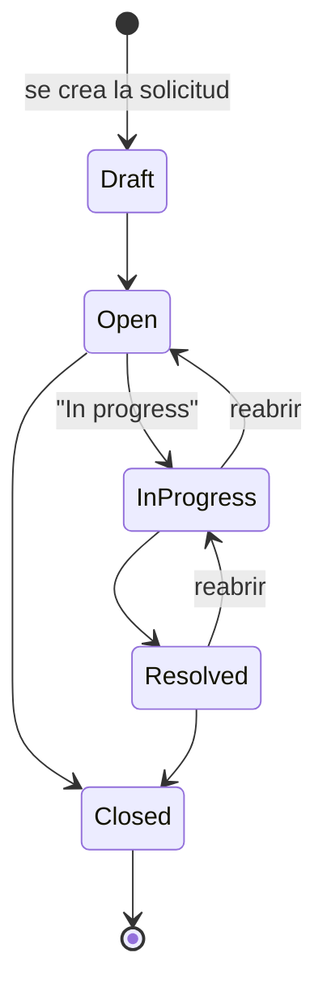

# Diagrama: ciclo de vida de una solicitud

Corresponde a `App\Enums\RequestStatus::allowedTransitions()` (backend) y `frontend/src/lib/statusFlow.ts` (frontend) — ambos deben mantenerse sincronizados; el backend es la autoridad, el frontend es solo una copia para decidir qué botones mostrar (ver comentario en `statusFlow.ts`).

`Closed` es terminal: no hay transición de vuelta. Para reactivar el trabajo hay que crear una solicitud nueva, no reabrir una cerrada — decisión deliberada para que el historial de una solicitud cerrada sea inmutable.
