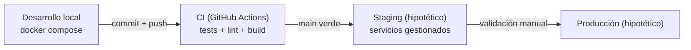

# Estrategia de entornos

## Entornos existentes hoy

| Entorno | Cómo se levanta | Base de datos | Cola | Propósito |
|---|---|---|---|---|
| Desarrollo local | `docker compose up -d` | MySQL en contenedor, volumen persistente | RabbitMQ en contenedor | Desarrollo activo y demo |
| Tests automatizados (backend) | `./vendor/bin/pest`, fuera de Docker | SQLite en memoria | Driver `sync` (sin cola real) | Feedback rápido; deliberadamente no usa MySQL/RabbitMQ reales — ver la limitación de cobertura que esto implica en la enmienda del [ADR 0003](adr/0003-multi-tenancy-strategy.md) |
| Tests automatizados (frontend) | `npm run test:unit` (Vitest) | N/A | N/A | Lógica de stores/composables aislada de la red |

## Entornos hipotéticos (no existen, documentados para completar la estrategia)

| Entorno | Propósito | Diferencia clave con local |
|---|---|---|
| Staging | Validar un cambio en condiciones de red/infraestructura reales antes de producción | Servicios gestionados de verdad (ver `deployment-runbook.md`), datos de demostración, sin tráfico real |
| Producción | Servir a organizaciones reales | `APP_DEBUG=false` obligatorio (ver `docs/observability.md`), backups de MySQL, alertas activas (ver `slo.md`) |

## Configuración por entorno

Cada entorno se diferencia solo por variables de entorno (`.env`), nunca por código distinto:

- `APP_ENV` / `APP_DEBUG`: en cualquier entorno que no sea desarrollo local, `APP_DEBUG` debe ser `false` — se verificó en la Sesión 3 que con `true` los errores 404 de aislamiento multi-tenant devuelven el stack trace completo.
- `DB_*` / `RABBITMQ_*`: apuntan a servicios gestionados en staging/producción en vez de a los contenedores de Docker Compose.
- `SANCTUM_STATEFUL_DOMAINS` / `FRONTEND_URL`: deben incluir el dominio real de la SPA en cada entorno — es la parte más fácil de olvidar al promocionar un cambio (ver `deployment-runbook.md`).
- Feature flags (Laravel Pennant): no son una diferencia de entorno, son una diferencia **por organización** dentro del mismo entorno — ver `architecture.md`. Esto es deliberado: permite probar una funcionalidad con un tenant real en producción sin necesitar un entorno de staging separado para ello.

## Estrategia de promoción

Un cambio nunca pasa de un entorno al siguiente si:
- Los tests automatizados no pasan (ver Definition of Done en `scope.md`).
- El test de arquitectura de aislamiento multi-tenant (`TenantScopingArchitectureTest.php`) está en rojo — es un bloqueante duro, no una advertencia.
- El health check de *readiness* del entorno de destino no responde `200` tras el despliegue (ver `deployment-runbook.md`).
